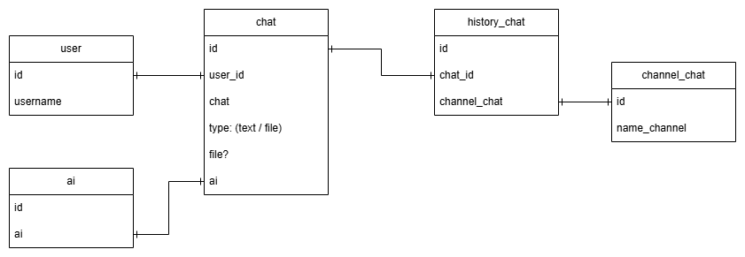

# Chat AI

An App like Gemini

## tech
- devtools: bun
- framework: nextjs
- backend: nextjs, hono
- ui: shadcn
- deployment: cloudflare
- database: d1
- validation: yup
- data-fetching: swr
- state-management: zustand
- authentication: firebase
- storage: r2
- payment-gateway: xendit
- orm: drizzle
- testing: playwright
- api testing: httpie

## feature
- login with google
- list history chat
- chat with ai
- user can pay for premium (free: 50mb storage, 50ask/day, premium: 100mb, 200ask/day)

## erd
